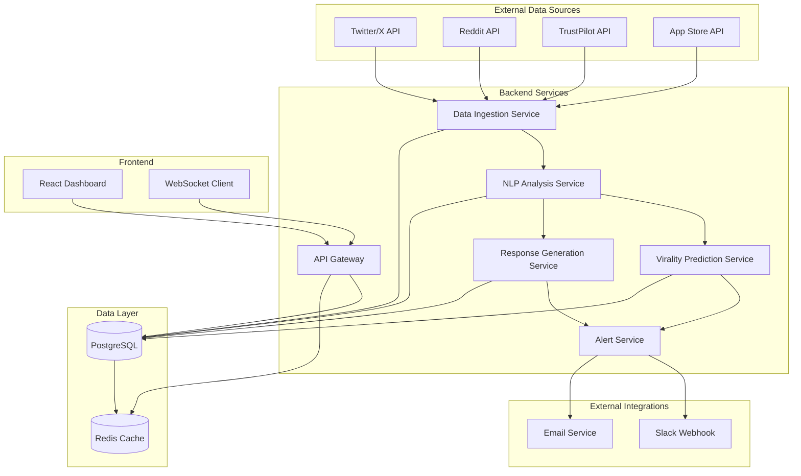

# Design Document

## Overview

The Customer Feedback Analyzer is a full-stack application built with a microservices architecture to handle real-time data ingestion, NLP processing, and interactive dashboard visualization. The system uses modern web technologies with WebSocket connections for real-time updates, REST APIs for data access, and a responsive React-based frontend.

## Architecture

### High-Level Architecture



### Technology Stack

**Backend:**
- Node.js with Express.js for API services
- TypeScript for type safety
- PostgreSQL for primary data storage
- Redis for caching and real-time data
- Socket.io for WebSocket connections
- Bull Queue for background job processing

**Frontend:**
- React 18 with TypeScript
- Next.js for SSR and routing
- Tailwind CSS for styling
- Chart.js/D3.js for data visualization
- Socket.io-client for real-time updates
- React Query for data fetching

**NLP & AI:**
- Hugging Face Transformers for sentiment analysis
- OpenAI GPT API for response generation
- Python microservice for NLP processing
- Custom virality prediction model

**Infrastructure:**
- Docker containers for deployment
- nginx for reverse proxy
- PM2 for process management

## Components and Interfaces

### 1. Authentication Service

**Purpose:** Handle user authentication and session management

**Key Components:**
- JWT token management
- Google OAuth 2.0 integration
- Email verification system
- Session middleware

**API Endpoints:**
```typescript
POST /auth/login
POST /auth/register
POST /auth/google
POST /auth/logout
GET /auth/verify-email/:token
POST /auth/refresh-token
```

### 2. Data Ingestion Service

**Purpose:** Collect and normalize data from multiple platforms

**Key Components:**
- Platform-specific adapters (Twitter, Reddit, TrustPilot, App Store)
- Rate limiting and retry logic
- Data normalization and validation
- Queue management for processing

**Data Flow:**
```typescript
interface FeedbackData {
  id: string;
  platform: 'twitter' | 'reddit' | 'trustpilot' | 'appstore';
  content: string;
  author: {
    username: string;
    followerCount?: number;
    verified?: boolean;
  };
  engagement: {
    likes: number;
    shares: number;
    comments: number;
  };
  timestamp: Date;
  metadata: Record<string, any>;
}
```

### 3. NLP Analysis Service

**Purpose:** Process text for sentiment and emotion detection

**Key Components:**
- Sentiment classifier (positive/neutral/negative)
- Emotion detection model (anger, sarcasm, frustration, betrayal, confusion, joy)
- Confidence scoring
- Batch processing capabilities

**Analysis Pipeline:**
```typescript
interface AnalysisResult {
  feedbackId: string;
  sentiment: {
    label: 'positive' | 'neutral' | 'negative';
    confidence: number;
  };
  emotions: Array<{
    emotion: string;
    confidence: number;
  }>;
  processedAt: Date;
}
```

### 4. Virality Prediction Service

**Purpose:** Calculate virality risk scores

**Key Components:**
- Feature extraction (tone severity, engagement velocity, user influence)
- Machine learning model for prediction
- Real-time scoring
- Threshold-based alerting

**Scoring Algorithm:**
```typescript
interface ViralityScore {
  feedbackId: string;
  score: number; // 0-100
  factors: {
    toneSeverity: number;
    engagementVelocity: number;
    userInfluence: number;
  };
  riskLevel: 'low' | 'medium' | 'high' | 'viral-threat';
}
```

### 5. Response Generation Service

**Purpose:** Generate AI-powered response drafts

**Key Components:**
- OpenAI GPT integration
- Company tone guidelines configuration
- Response templates
- Multi-option generation

**Response Structure:**
```typescript
interface ResponseDraft {
  feedbackId: string;
  drafts: Array<{
    content: string;
    tone: string;
    confidence: number;
  }>;
  guidelines: string[];
  generatedAt: Date;
}
```

### 6. Real-time Dashboard Service

**Purpose:** Provide WebSocket connections for live updates

**Key Components:**
- Socket.io server
- Room-based subscriptions
- Event broadcasting
- Connection management

**WebSocket Events:**
```typescript
// Client to Server
'join-dashboard'
'subscribe-alerts'
'subscribe-heatmap'

// Server to Client
'new-feedback'
'analysis-complete'
'alert-triggered'
'heatmap-update'
```

## Data Models

### Database Schema

**Users Table:**
```sql
CREATE TABLE users (
  id UUID PRIMARY KEY DEFAULT gen_random_uuid(),
  email VARCHAR(255) UNIQUE NOT NULL,
  password_hash VARCHAR(255),
  google_id VARCHAR(255),
  email_verified BOOLEAN DEFAULT FALSE,
  created_at TIMESTAMP DEFAULT NOW(),
  updated_at TIMESTAMP DEFAULT NOW()
);
```

**Feedback Table:**
```sql
CREATE TABLE feedback (
  id UUID PRIMARY KEY DEFAULT gen_random_uuid(),
  platform VARCHAR(50) NOT NULL,
  external_id VARCHAR(255),
  content TEXT NOT NULL,
  author_username VARCHAR(255),
  author_follower_count INTEGER,
  author_verified BOOLEAN,
  likes INTEGER DEFAULT 0,
  shares INTEGER DEFAULT 0,
  comments INTEGER DEFAULT 0,
  posted_at TIMESTAMP,
  ingested_at TIMESTAMP DEFAULT NOW(),
  metadata JSONB
);
```

**Analysis Table:**
```sql
CREATE TABLE analysis (
  id UUID PRIMARY KEY DEFAULT gen_random_uuid(),
  feedback_id UUID REFERENCES feedback(id),
  sentiment VARCHAR(20) NOT NULL,
  sentiment_confidence DECIMAL(3,2),
  emotions JSONB,
  virality_score INTEGER,
  virality_factors JSONB,
  risk_level VARCHAR(20),
  processed_at TIMESTAMP DEFAULT NOW()
);
```

**Responses Table:**
```sql
CREATE TABLE responses (
  id UUID PRIMARY KEY DEFAULT gen_random_uuid(),
  feedback_id UUID REFERENCES feedback(id),
  drafts JSONB NOT NULL,
  selected_draft TEXT,
  sent_at TIMESTAMP,
  sent_to VARCHAR(255),
  status VARCHAR(20) DEFAULT 'draft',
  created_at TIMESTAMP DEFAULT NOW()
);
```

### Redis Data Structures

**Real-time Feed:**
```
feedback:live -> Sorted Set (score: timestamp)
analysis:pending -> List
alerts:active -> Hash
heatmap:current -> Hash (platform/region -> emotion counts)
```

## Error Handling

### API Error Responses

**Standard Error Format:**
```typescript
interface ApiError {
  error: {
    code: string;
    message: string;
    details?: any;
    timestamp: string;
  };
}
```

**Error Categories:**
- Authentication errors (401, 403)
- Validation errors (400)
- Rate limiting errors (429)
- External API errors (502, 503)
- Internal server errors (500)

### Retry Strategies

**Data Ingestion:**
- Exponential backoff for API failures
- Circuit breaker pattern for external services
- Dead letter queue for failed messages

**NLP Processing:**
- Retry with different model endpoints
- Fallback to simpler analysis methods
- Manual review queue for failures

## Testing Strategy

### Unit Testing
- Service layer business logic
- Data transformation functions
- Utility functions and helpers
- Mock external API responses

### Integration Testing
- Database operations
- External API integrations
- WebSocket connections
- Authentication flows

### End-to-End Testing
- Complete user workflows
- Real-time dashboard functionality
- Alert system triggers
- Response generation and sending

### Performance Testing
- Load testing for concurrent users
- Stress testing for data ingestion
- WebSocket connection limits
- Database query optimization

### Test Data Strategy
- Mock data generators for each platform
- Synthetic feedback with known sentiment
- Edge cases and error conditions
- Performance benchmarking datasets

## Security Considerations

### Authentication & Authorization
- JWT tokens with short expiration
- Refresh token rotation
- Role-based access control
- OAuth 2.0 security best practices

### Data Protection
- Encryption at rest for sensitive data
- HTTPS/WSS for all communications
- Input validation and sanitization
- SQL injection prevention

### API Security
- Rate limiting per user/IP
- API key management for external services
- CORS configuration
- Request size limits

### Privacy Compliance
- Data retention policies
- User consent management
- Data anonymization options
- GDPR compliance measures

## Performance Optimization

### Caching Strategy
- Redis for frequently accessed data
- CDN for static assets
- Browser caching for dashboard components
- Database query result caching

### Real-time Performance
- WebSocket connection pooling
- Event batching for high-frequency updates
- Client-side data buffering
- Selective data streaming

### Database Optimization
- Proper indexing strategy
- Query optimization
- Connection pooling
- Read replicas for analytics

### Scalability Considerations
- Horizontal scaling for API services
- Queue-based processing for NLP
- Load balancing for WebSocket connections
- Database sharding strategies